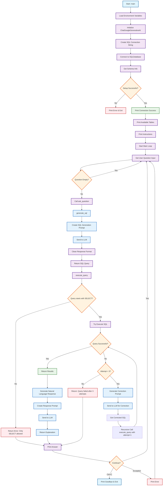

# SQL Chatbot Application Flow

This flowchart shows the complete workflow of the SQL chatbot application, from initialization to user interaction and query processing.

## Key Components

### 🚀 Initialization Phase
- **Environment Setup**: Loads API keys and database credentials
- **LLM Connection**: Initializes Google Gemini AI model
- **Database Connection**: Connects to SQL Server database
- **Schema Discovery**: Retrieves table structures and relationships

### 🔄 Main Loop
- **User Input**: Accepts natural language questions
- **SQL Generation**: Converts questions to SQL queries using LLM
- **Query Execution**: Runs queries with retry logic and error correction
- **Response Generation**: Creates natural language explanations

### 🛡️ Safety & Error Handling
- **Query Validation**: Only SELECT statements allowed
- **Retry Logic**: Up to 3 attempts with automatic correction
- **Error Recovery**: Graceful handling of connection and query failures

### 🎨 Color Legend
- **Blue**: LLM operations and AI interactions
- **Purple**: General processing steps
- **Orange**: Decision points and conditionals
- **Red**: Error handling and failures
- **Green**: Success states and confirmations

## Usage
1. Copy this entire markdown content
2. Create a new `.md` file in your GitHub repository (e.g., `FLOWCHART.md` or add to `README.md`)
3. Paste the content
4. Commit and push - GitHub will automatically render the Mermaid diagram!