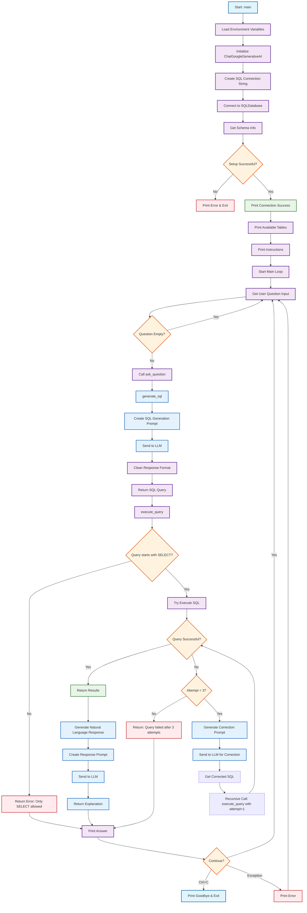

LLM SQL Chatbot
A proof-of-concept app to ask a database your data questions in human language.
The LLM will understand your question, write a SQL query for it, retrieve data, and translate the results back in human language.
This proof-of-concept uses free open-source components:
Gemma 3-4B (LLM), MS SQL Server Express 2022 (database), LangChain (framework)

# SQL Chatbot Application Flow

This flowchart shows the complete workflow of the SQL chatbot application, from initialization to user interaction and query processing.

## Key Components

### 🚀 Initialization Phase
- **Environment Setup**: Loads API keys and database credentials
- **LLM Connection**: Initializes Google Gemini AI model
- **Database Connection**: Connects to SQL Server database
- **Schema Discovery**: Retrieves table structures and relationships

### 🔄 Main Loop
- **User Input**: Accepts natural language questions
- **SQL Generation**: Converts questions to SQL queries using LLM
- **Query Execution**: Runs queries with retry logic and error correction
- **Response Generation**: Creates natural language explanations

### 🛡️ Safety & Error Handling
- **Query Validation**: Only SELECT statements allowed
- **Retry Logic**: Up to 3 attempts with automatic correction
- **Error Recovery**: Graceful handling of connection and query failures

### 🎨 Color Legend
- **Blue**: LLM operations and AI interactions
- **Purple**: General processing steps
- **Orange**: Decision points and conditionals
- **Red**: Error handling and failures
- **Green**: Success states and confirmations